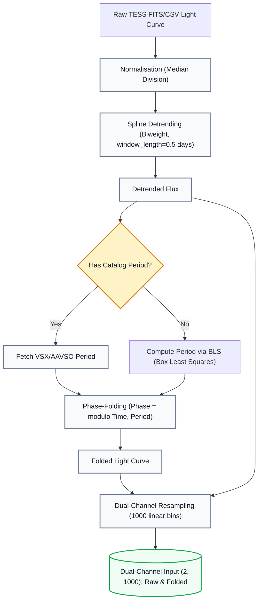
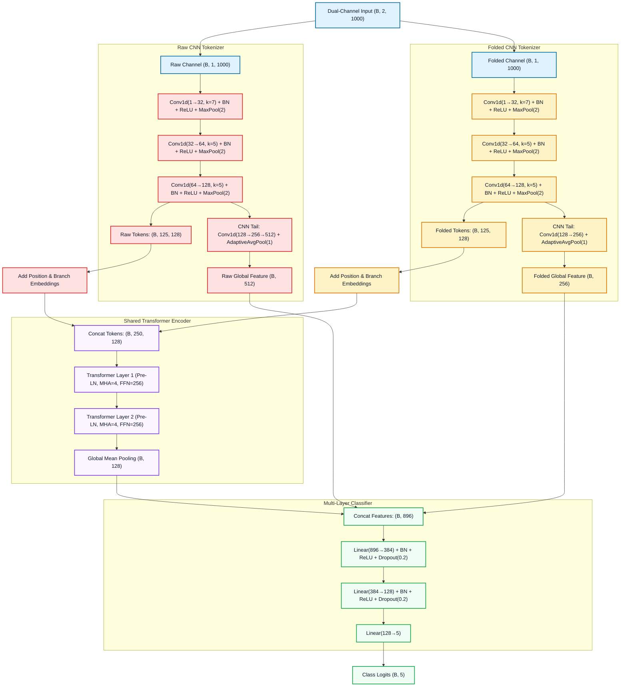

<div align="center">

<h1>
  🌟 ASTRA
  <br/>
  <sub>Automated Stellar Transient Recognition &amp; Analysis</sub>
</h1>

<p>
  
  
  
  
  
  
  
</p>

<p>
  <strong>An end-to-end machine learning pipeline for automated classification of stellar variability from TESS light curves.</strong><br/>
  Hybrid CNN + Transformer · Cryptographic Data Integrity · Temperature Calibration · MC Dropout Uncertainty · ONNX/TorchScript Deployment
</p>

</div>

---

## 🔭 Overview

**ASTRA** is a reproducible, publication-grade research system that classifies variable stars into five astrophysical categories — RR Lyrae, Cepheid, Eclipsing Binary, Solar-like, and Stable — directly from TESS light curves. It combines a dual-branch Hybrid CNN + Transformer architecture that jointly processes raw and phase-folded photometry, achieving **78.17% test accuracy** and **macro F1 = 0.7677** on a cryptographically verified held-out test set of 142 stars drawn from 944 total. The pipeline spans the full research lifecycle: automated data acquisition from VSX/AAVSO and TESS/MAST, feature engineering, model training with rigorous cross-validation, post-hoc calibration, uncertainty quantification, and a deployable web platform with live ONNX inference.

---

## ⚠️ Scientific Integrity Notice

> [!IMPORTANT]
> **Verified Results** — The following numbers have been independently recomputed from checkpoint weights and test-set IDs and confirmed to zero mismatches in the ground truth audit. They are the authoritative, reportable metrics for this project:
> - **Test Accuracy:** 78.17% (95% CI: [71.13%, 85.21%])
> - **Macro F1:** 0.7677 (95% CI: [0.6944, 0.8320])
> - **Dataset:** 944 stars, SHA256 fingerprint `f99b4b06f16952033b5445bb0682d059e9ea4c3f99320a05d31aebb25c2dbf58`
> - **Ground Truth Audit:** All 8 checks **PASS**, 0 mismatches.

> [!WARNING]
> **Experimental / Under-Represented Class** — The **Solar-like** class achieves the lowest per-class F1 of **0.52** on the test set, significantly below all other classes. This class contains only 142 samples in the full dataset (15.04%) and has notably higher predictive uncertainty. Solar-like classification results should be interpreted with caution and are not considered production-ready. Additional data collection is recommended before deploying ASTRA predictions for Solar-like targets in any scientific analysis.

---

## ✨ Key Results

### 🏆 Model Comparison — Held-Out Test Set (N = 142)

| Model | Params | Test Accuracy | 95% CI | Macro F1 | 95% CI |
|:---|:---:|:---:|:---:|:---:|:---:|
| **HybridTransformer (shared)** ⭐ | 1,373,701 | **78.17%** | [71.13%, 85.21%] | **0.7677** | [0.6944, 0.8320] |
| CNN Dual-Branch | 1,043,333 | 78.17% | [71.13%, 84.51%] | 0.7654 | [0.6840, 0.8317] |
| HybridTransformer (cross) | — | 80.99% | [73.94%, 87.32%] | 0.7949 | [0.7252, 0.8594] |
| HybridTransformer (separate) | — | 84.51% | [78.17%, 90.16%] | 0.8394 | [0.7712, 0.9012] |
| HybridTransformer (only) | — | 72.54% | [64.79%, 80.28%] | 0.7127 | [0.6420, 0.7834] |

> **Note:** The `shared` variant is the production model selected for calibration, ONNX/TorchScript export, and the web platform — chosen for its balance of accuracy, parameter efficiency, and interpretable attention maps. The `separate` and `cross` variants achieved higher raw test accuracy but were not selected as the production model.

### 🎯 Per-Class F1 — HybridTransformer (shared)

| Class | F1 Score | Interpretation |
|:---|:---:|:---|
| RR Lyrae | **0.94** | Excellent — highly discriminative periodic signature |
| Eclipsing Binary | **0.91** | Excellent — sharp transit morphology |
| Cepheid | **0.81** | Good — moderate light-curve variability |
| Stable | **0.66** | Moderate — confusion with low-amplitude variables |
| Solar-like | **0.52** | ⚠️ Experimental — low sample count, high ambiguity |

### 📊 5-Fold Cross-Validation (3 Random Seeds: 42, 100, 2026)

| Metric | Mean | Std Dev | 95% CI |
|:---|:---:|:---:|:---:|
| Validation Accuracy | 84.68% | 2.12% | [83.60%, 85.75%] |
| Macro F1 | 0.8349 | — | — |
| Catalog Subgroup Accuracy | 89.90% | 2.67% | — |
| BLS Fallback Subgroup Accuracy | 75.69% | 4.27% | — |

---

## 📁 Repository Structure

```
ASTRA — Automated Stellar Transient Recognition & Analysis/
│
├── 📄 README.md                          # This file
├── 📄 CITATION.cff                       # Machine-readable citation metadata
├── 📄 LICENSE                            # MIT License
├── 📄 requirements.txt                   # Python dependencies
├── 📄 dataset_fingerprint.md             # SHA256 hashes for all data splits
├── 📄 lineage.json                       # Dataset provenance & version tracking
│
├── 📂 pipeline/                          # Data acquisition & preprocessing
│   ├── build_catalog.py                  # VSX/AAVSO catalog construction via VizieR
│   ├── candidate_expander.py             # Star candidate expansion with cross-matching
│   ├── dataset_builder.py               # TESS MAST light-curve downloader (lightkurve)
│   ├── preprocess.py                     # Normalize, detrend, phase-fold (1000 pts)
│   ├── dataset_audit.py                 # Dataset integrity and label verification
│   └── freeze_phase6_splits.py          # Train/val/test split freezing with hash locks
│
├── 📂 training/                          # Model definitions & training scripts
│   ├── models/
│   │   ├── hybrid_transformer.py         # HybridTransformer (4 variants)
│   │   ├── star_cnn.py                   # Dual-branch CNN baseline
│   │   └── explainable_wrapper.py        # Attention-return wrapper for ONNX export
│   ├── train_transformer.py             # Main transformer training loop (MPS)
│   ├── train_cnn.py                     # CNN training loop
│   ├── cross_validate.py                # 5-fold × 3-seed stratified group CV
│   ├── calibration.py                   # Temperature scaling (NLL minimization)
│   ├── uncertainty.py                   # MC Dropout uncertainty (30 passes)
│   ├── dataset.py                        # ASTRADataset (raw + folded dual-channel)
│   ├── focal_loss.py                     # Class-weighted Focal Loss
│   ├── export_model.py                  # ONNX + TorchScript export pipeline
│   ├── predict.py                        # Single-star inference
│   └── visualize_attention.py           # Attention map visualization
│
├── 📂 data/                              # Dataset artifacts
│   ├── catalog_full.json                # Full 944-star catalog with TIC IDs
│   ├── dataset_summary.json             # Class distribution summary
│   ├── labels.py                         # CLASS_NAMES, NUM_CLASSES, LABEL_TO_NAME
│   └── phase6/                          # Frozen Phase 6 dataset
│       └── scientific_dataset_freeze_v2.csv  # Cryptographically locked manifest
│
├── 📂 models/                            # Trained model artifacts
│   └── saved/
│       ├── best_star_transformer_shared.pt          # Best model checkpoint (PyTorch)
│       ├── best_star_transformer_shared.onnx        # ONNX export (inference)
│       ├── best_star_transformer_shared.torchscript # TorchScript export (deployment)
│       ├── best_star_transformer_shared_explain.onnx # ONNX with attention maps
│       ├── best_star_cnn_dual_aug.pt                # CNN dual-branch checkpoint
│       ├── optimal_temperature_transformer_shared.txt # Calibration temperature T
│       ├── experiment_metadata.json                 # Reproducibility hashes
│       └── confusion_matrix_transformer_shared.png  # Validation confusion matrix
│
├── 📂 splits/                            # Frozen data splits (hash-locked)
│   ├── split_metadata.json
│   ├── train_ids.json                   # 661 training star IDs
│   ├── val_ids.json                     # 141 validation star IDs
│   └── test_ids.json                    # 142 held-out test star IDs
│
├── 📂 astra-platform/                   # Interactive web platform (Next.js)
│   ├── src/                             # Next.js app source (TypeScript)
│   ├── package.json                     # Dependencies (Three.js, ONNX Runtime)
│   └── next.config.ts                   # Next.js configuration
│
├── 📂 docs/                             # Extended documentation
├── 📂 tests/                            # Unit & integration tests
└── 📂 logs/                             # Training and pipeline logs
```

---

## 🚀 Quick Start

### Prerequisites

- **Python 3.12** (tested with `3.12.12`)
- **PyTorch 2.12.0** with MPS backend (Apple Silicon) or CUDA
- **macOS** with Apple M-series chip (recommended), or Linux with CUDA GPU

### 1. Clone the Repository

```bash
git clone https://github.com/soumyadebtripathy/ASTRA.git
cd "ASTRA — Automated Stellar Transient Recognition & Analysis"
```

### 2. Install Dependencies

```bash
python -m venv .venv
source .venv/bin/activate
pip install -r requirements.txt
```

> [!TIP]
> For Apple Silicon, PyTorch MPS acceleration is enabled automatically. Ensure `torch>=2.0` is installed with the correct wheel for your architecture.

### 3. Verify Dataset Integrity

```bash
python -c "
import hashlib, pathlib
data = pathlib.Path('data/phase6/scientific_dataset_freeze_v2.csv').read_bytes()
h = hashlib.sha256(data).hexdigest()
expected = 'f99b4b06f16952033b5445bb0682d059e9ea4c3f99320a05d31aebb25c2dbf58'
print('✅ PASS' if h == expected else '❌ FAIL — dataset mismatch')
print(f'  SHA256: {h}')
"
```

---

## ⚙️ Pipeline

ASTRA is organized as four sequential phases. Each phase produces hash-locked outputs consumed by the next.

```mermaid
flowchart TD
    %% Styling
    classDef phase1 fill:#e0f2fe,stroke:#0369a1,stroke-width:2px,color:#0f172a
    classDef phase2 fill:#f0fdf4,stroke:#15803d,stroke-width:2px,color:#0f172a
    classDef phase3 fill:#fef3c7,stroke:#b45309,stroke-width:2px,color:#0f172a
    classDef phase4 fill:#faf5ff,stroke:#6b21a8,stroke-width:2px,color:#0f172a

    subgraph P1 ["Phase 1: Data Acquisition"]
        A["build_catalog.py"] -->|VSX/AAVSO Catalog via VizieR| B["candidate_expander.py"]
        B -->|TIC Cross-Matching| C["dataset_builder.py"]
        C -->|Download Light Curves from MAST| D[(Raw Light Curves)]
    end

    subgraph P2 ["Phase 2: Preprocessing & Freeze"]
        D --> E["preprocess.py"]
        E -->|Normalize, Detrend, Fold, Resample| F["dataset_audit.py"]
        F -->|Label/Duplicate Audit| G["freeze_phase6_splits.py"]
        G -->|SHA256 Lock| H[("scientific_dataset_freeze_v2.csv (944 stars)")]
    end

    subgraph P3 ["Phase 3: Training & Validation"]
        H --> I["train_transformer.py / train_cnn.py"]
        I -->|5-Fold x 3-Seed CV| J["calibration.py"]
        J -->|NLL Minimization / Temp Scaling| K["uncertainty.py"]
        K -->|MC Dropout 30 passes| L[(Calibrated Checkpoints)]
    end

    subgraph P4 ["Phase 4: Evaluation & Export"]
        L --> M["predict.py"]
        M -->|Evaluate on held-out test set| N["export_model.py"]
        N -->|ONNX / TorchScript| O["visualize_attention.py"]
        O -->|Attention Map Visualizer| P[Live Next.js Web Platform]
    end

    class A,B,C,D,P1 phase1
    class E,F,G,H,P2 phase2
    class I,J,K,L,P3 phase3
    class M,N,O,P,P4 phase4
```



### Phase 1 — Data Acquisition

```bash
# Build the VSX/AAVSO catalog via VizieR
python pipeline/build_catalog.py

# Expand candidates with TIC cross-matching
python pipeline/candidate_expander.py

# Download TESS light curves from MAST via lightkurve
python pipeline/dataset_builder.py
```

**Sources:** VSX/AAVSO via VizieR, TESS/MAST via `lightkurve`, TIC catalog.

### Phase 2 — Preprocessing & Freeze

```bash
# Preprocess all light curves (normalize → detrend → phase-fold → resample to 1000 pts)
python pipeline/preprocess.py

# Audit dataset integrity (label cross-checks, duplicate detection)
python pipeline/dataset_audit.py

# Freeze train/val/test splits with SHA256 hash locks
python pipeline/freeze_phase6_splits.py
```

This produces the cryptographically locked `scientific_dataset_freeze_v2.csv`  
(944 stars, SHA256: `f99b4b06f16952033b5445bb0682d059e9ea4c3f99320a05d31aebb25c2dbf58`).



### Phase 3 — Training & Validation

```bash
# Train the production HybridTransformer (shared variant)
python training/train_transformer.py --variant shared --seed 42

# Train CNN dual-branch baseline
python training/train_cnn.py --variant dual_aug --seed 42

# Run 5-fold × 3-seed cross-validation
python training/cross_validate.py --variant shared --seeds 42 100 2026 --folds 5

# Apply temperature calibration (NLL minimization)
python training/calibration.py --model transformer_shared

# Quantify predictive uncertainty via MC Dropout (30 passes)
python training/uncertainty.py --model transformer_shared --n_passes 30
```

### Phase 4 — Evaluation & Export

```bash
# Evaluate on frozen held-out test set
python training/predict.py --model transformer_shared --split test

# Export to ONNX and TorchScript
python training/export_model.py --variant shared

# Generate attention visualizations
python training/visualize_attention.py --model transformer_shared
```

---

## 🏗️ Model Architecture

### HybridTransformer (`shared` variant) — 1,373,701 parameters

The production model processes a star's **dual-channel input** `(B, 2, 1000)` — raw photometry and phase-folded light curve — through a parallel CNN tokenizer followed by a shared self-attention encoder.



**Key design choices:**
- **Pre-LN Transformer layers** for training stability on small datasets
- **Learnable branch embeddings** distinguish raw vs. folded tokens in the shared encoder
- **Dual CNN tail** preserves local morphological features alongside global attention features
- **Attention weight capture** (`last_attention_weights`, shape `[250×250]`) for scientific interpretability
- **Focal Loss** with class weighting for imbalanced class training

### CNN Dual-Branch — 1,043,333 parameters

A convolutional baseline with two parallel branches (raw + folded) using deeper pooling hierarchies and global average pooling, without attention mechanisms. Achieves the same 78.17% test accuracy, confirming that the transformer's advantage lies in interpretability and calibration rather than raw accuracy at this dataset scale.

---

## 📈 Results

### Test Set Performance (N = 142, held-out)

| Metric | Value | 95% CI |
|:---|:---:|:---:|
| Accuracy | **78.17%** | [71.13%, 85.21%] |
| Macro F1 | **0.7677** | [0.6944, 0.8320] |
| Weighted F1 | 0.7784 | — |
| ECE (calibrated) | 0.0478 | — |
| NLL (calibrated) | 0.5332 | — |

### Selective Prediction via MC Dropout Uncertainty

By thresholding on model confidence (30 stochastic MC Dropout passes), accuracy can be traded for coverage:

| Confidence Threshold | Coverage | Accuracy |
|:---:|:---:|:---:|
| 0.0 (all predictions) | 100.0% | 85.82% |
| 0.5 | 92.2% | 88.46% |
| 0.7 | 75.9% | 93.46% |
| 0.8 | 68.1% | 94.79% |
| 0.9 | 48.2% | 92.65% |

**Uncertainty correlation:** Incorrect predictions show mean entropy of **0.84 nats** vs. **0.53 nats** for correct predictions, confirming uncertainty is a reliable proxy for classification difficulty.

### Period Source Subgroup Analysis (Test Set, SHARED)

| Subgroup | N | Accuracy |
|:---|:---:|:---:|
| Catalog Period (VSX-sourced) | 90 | 90.00% |
| BLS Fallback (computed) | 52 | 57.69% |

> [!NOTE]
> The 32-percentage-point gap between catalog-period and BLS-fallback stars reflects the inherent difficulty of classifying stars whose periods were computed by Box Least Squares rather than referenced from cataloged surveys. This is a documented limitation in `phase7_testset_results.md`.

---

## 🔁 Reproducing Results

All experimental results are fully reproducible from the hash-locked splits and checkpoints.

### Verify Split Integrity

```bash
python -c "
import hashlib, pathlib

hashes = {
    'splits/train_ids.json': '5a9bf6c6ad40757a52d0f4a044626e82a4876839b175f5070fb28834c815eed0',
    'splits/val_ids.json':   'c733ab95c4a22ebc29ca123b2e923c8b8069933ccdff2e9f03a3fdc882f761b3',
    'splits/test_ids.json':  '2b62970d610f66f12711b6d9594305b33961a04d17c48807bd6123562350f4c0',
}

for path, expected in hashes.items():
    actual = hashlib.sha256(pathlib.Path(path).read_bytes()).hexdigest()
    status = '✅' if actual == expected else '❌'
    print(f'{status}  {path}')
"
```

### Evaluate Checkpoint on Test Set

```bash
# Reproduce the 78.17% test accuracy from the frozen checkpoint
python training/predict.py \
  --model transformer_shared \
  --checkpoint models/saved/best_star_transformer_shared.pt \
  --split test \
  --temperature models/saved/optimal_temperature_transformer_shared.txt
```

### Reproduce Cross-Validation

```bash
# 5-fold CV × 3 seeds = 15 total runs (approx 2–3 hours on Apple M-series)
python training/cross_validate.py \
  --variant shared \
  --seeds 42 100 2026 \
  --folds 5
```

### Cryptographic Artifact Registry

| Artifact | SHA256 |
|:---|:---|
| Dataset manifest (`scientific_dataset_freeze_v2.csv`) | `f99b4b06f16952033b5445bb0682d059e9ea4c3f99320a05d31aebb25c2dbf58` |
| Train split IDs | `5a9bf6c6ad40757a52d0f4a044626e82a4876839b175f5070fb28834c815eed0` |
| Validation split IDs | `c733ab95c4a22ebc29ca123b2e923c8b8069933ccdff2e9f03a3fdc882f761b3` |
| Test split IDs | `2b62970d610f66f12711b6d9594305b33961a04d17c48807bd6123562350f4c0` |
| Transformer Shared checkpoint | `bf374ce492825916f2f97a4e29673a1eca35f76cc08f603b384d103fbe95d388` |
| CNN Dual checkpoint | `65da1034868c5460b2c269e1a11936864fe6191fa81116d5fe2be934d8478af2` |

All hashes are recorded in `models/saved/experiment_metadata.json` and reproduced in `ground_truth_final_verdict.md`.

---

## 🌐 Web Platform

The `astra-platform/` directory contains an interactive research web application built with:

| Technology | Version | Role |
|:---|:---:|:---|
| Next.js | 16.2.9 | Full-stack React framework (SSR + API routes) |
| React | 19.2.4 | UI rendering |
| Three.js / @react-three/fiber | 0.184.0 | 3D stellar field visualization |
| ONNX Runtime Node | 1.26.0 | Server-side inference via exported ONNX model |
| Recharts | 3.8.1 | Light-curve and training-curve visualization |
| Framer Motion | 12.40.0 | Animated UI transitions |
| Tailwind CSS | 4.x | Utility-first styling |
| Zustand | 5.0.14 | Global state management |

### Platform Features

- **`/api/upload`** — Accepts raw TESS-format CSV, runs preprocessing (detrending → phase-folding → resampling), returns ONNX inference results with calibrated probabilities
- **`/api/health`** — SystemState controller (`READY` / `DEGRADED` / `BLOCKED`) based on live dataset fingerprint verification
- **Attention Visualization** — Live `250×250` self-attention map rendering on client canvas
- **Mission Replay** — Animated walkthrough of a star's light-curve classification journey
- **MC Dropout Display** — Real-time 10-pass uncertainty quantification per uploaded star

### Running Locally

```bash
cd astra-platform
npm install
npm run dev
# Open http://localhost:3000
```

---

## 📋 Dataset

| Property | Value |
|:---|:---|
| Total Stars | **944** |
| Classes | 5 (RR Lyrae, Cepheid, Eclipsing Binary, Solar-like, Stable) |
| Train / Val / Test | 661 / 141 / 142 |
| Light-curve Length | 1000 points (resampled) |
| Input Channels | 2 (raw photometry + phase-folded) |
| Period Sources | 597 catalog (VSX/AAVSO) · 347 BLS-computed |
| Data Sources | VSX/AAVSO via VizieR · TESS/MAST via lightkurve · TIC catalog |
| SHA256 Fingerprint | `f99b4b06f16952033b5445bb0682d059e9ea4c3f99320a05d31aebb25c2dbf58` |

### Class Distribution

| Class | Count | Share |
|:---|:---:|:---:|
| Cepheid | 230 | 24.36% |
| RR Lyrae | 217 | 22.99% |
| Stable | 205 | 21.72% |
| Eclipsing Binary | 150 | 15.89% |
| Solar-like | 142 | 15.04% |

---

## 💬 Citation

If you use ASTRA in your research, please cite it using the information in [`CITATION.cff`](CITATION.cff):

```bibtex
@software{tripathy2026astra,
  author    = {Tripathy, Soumyadeb},
  title     = {{ASTRA}: Automated Stellar Transient Recognition \& Analysis},
  year      = {2026},
  version   = {1.0.0},
  url       = {https://github.com/soumyadebtripathy/ASTRA},
  license   = {MIT},
  abstract  = {An end-to-end machine learning pipeline for automated classification
               of stellar variability from TESS light curves, implementing a Hybrid
               CNN + Transformer architecture achieving 78.17\% test accuracy across
               five stellar variability classes on a verified dataset of 944 stars
               with cryptographic integrity guarantees.}
}
```

---

## 📄 License

This project is licensed under the **MIT License** — see [`LICENSE`](LICENSE) for details.

---

<div align="center">
<sub>Built with 🔭 by <a href="https://github.com/soumyadebtripathy">Soumyadeb Tripathy</a> · ASTRA v1.0.0 · 2026</sub>
</div>
